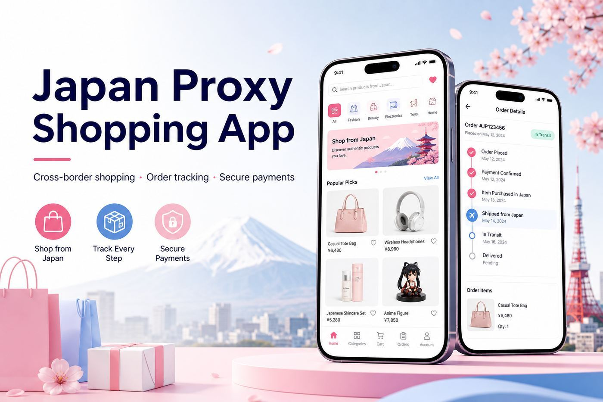
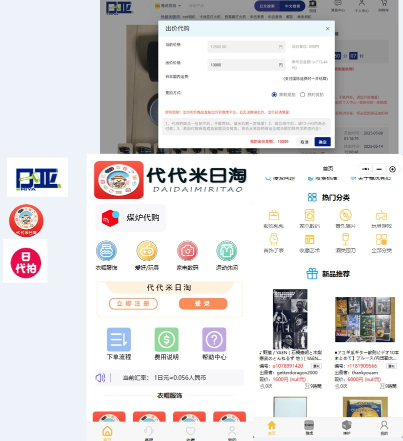
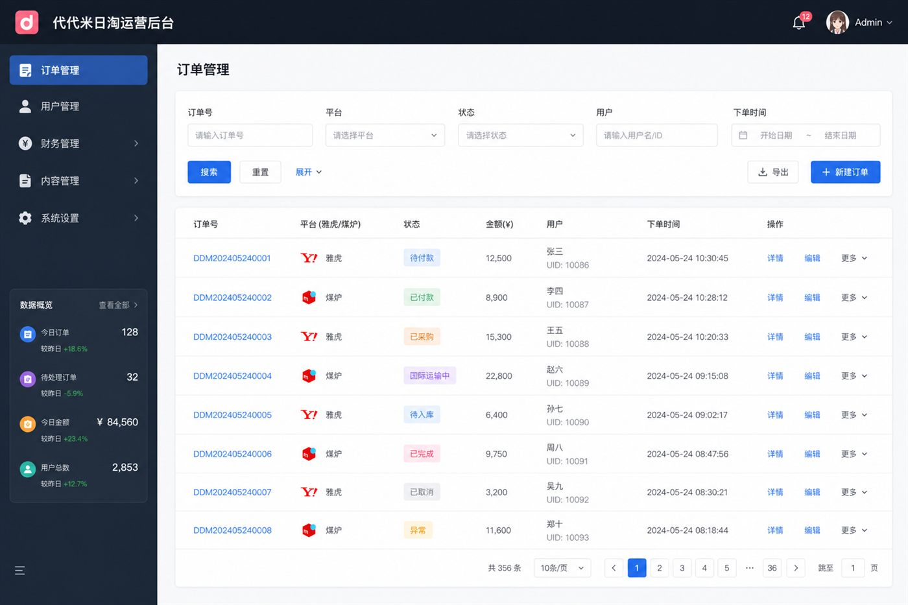
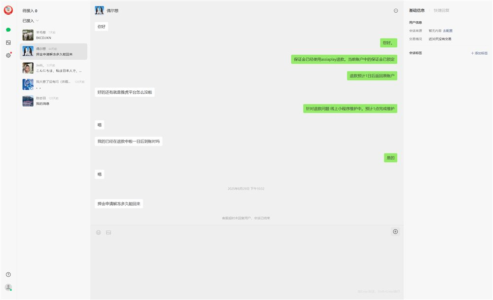

# Daidaimi Japan Shopping · Cross-border Mini Program

[](LICENSE)

A complete **Japanese cross-border shopping / proxy buying** full-stack solution for Chinese users, supporting Yahoo Auctions and Mercari. This repository includes the **WeChat mini program**, **admin dashboard**, **backend API service**, and a warehouse app scaffold.

> Backend is the Spring Boot web layer (Controllers). It depends on the `demo-service-logic` business module (contact the author or implement yourself).

<p align="center">
  
</p>

<p align="center">
  
</p>

---

## Screenshots

### Mini program / Web UI

Real product UI collage: home categories, recommendations, Yahoo auction bidding, and more.

<p align="center">
  
</p>

### Admin dashboard

Orders, users, finance, content and settings in one operations console (illustrative mock).

<p align="center">
  
</p>

### Customer service console

Live chat sessions, quick replies and user side panel for after-sales support.

<p align="center">
  
</p>

---

## Overview

**Daidaimi Japan Shopping** is a mature proxy-buying system covering the full flow: product browsing, payment, Japan warehouse inbound, consolidated shipping, and domestic delivery.

**Business model:**

- Users search and browse products from Japanese e-commerce platforms
- The platform places orders or bids on behalf of users; goods go to a Japan warehouse first
- Users can merge multiple orders, choose shipping routes, and pay international shipping before delivery to China
- Revenue from exchange rates, service fees, auction deposits, storage/packing/international shipping fees
- Referral code and distributor commission system supported

**Supported platforms:**

| Platform | Mode | Description |
|----------|------|-------------|
| **Yahoo Auctions** | Auction proxy | Scheduled/instant bids, buy-it-now; deposit required |
| **Mercari** | Fixed-price | Shopping cart and batch checkout |

---

## Repository Structure

```
ddmGit/
├── 前台小程序/              # User WeChat mini program (core)
├── 后台管理/                # Admin web dashboard
├── 后端服务/                # Spring Boot backend API (Controller layer)
├── 代代米日淘出入库APP/      # Warehouse app scaffold (WIP)
├── docs/
│   ├── wechat-qrcode.png    # Author WeChat QR code
│   └── screenshots/         # Promo & UI screenshots
├── README.md
└── README.en.md
```

---

## Tech Stack

| Sub-project | Framework | UI |
|-------------|-----------|-----|
| Mini program | uni-app + Vue 2 | uni-ui |
| Admin | Vue 2 + Vue CLI 5 | Element UI 2 |
| Backend | Spring Boot + MyBatis | Druid, Redis, Swagger |
| Warehouse app | uni-app + Vue 2 | uni-ui (WIP) |

---

## Quick Start

### Mini program

1. Open `前台小程序/` in HBuilderX
2. Update WeChat AppID in `manifest.json`
3. Update API base URL in `utils/url.js`
4. Run to WeChat DevTools

### Admin dashboard

```bash
cd 后台管理
yarn install
yarn serve
yarn build
```

---

## Backend API

Backend Controllers are in `后端服务/`. Requires `demo-service-logic` module (contact author).

See:
- `前台小程序/utils/api.js`
- `后台管理/src/http/api.js`
- `后端服务/src/main/java/com/zhwl/demo/controller/`

---

## Contact · Custom Development / Business

This project is open source. For **custom development, private deployment, technical consulting, or business cooperation**:

| Contact | Info |
|---------|------|
| **Phone** | +86 18515262695 |
| **Website** | https://www.jsdata.website/ |
| **WeChat** | Scan QR code below |

<p align="center">
  
</p>

Services: deployment guidance, backend integration, feature customization, new platform integration (Rakuten, Amazon, etc.), warehouse app development.

---

## License

[MIT License](LICENSE)
